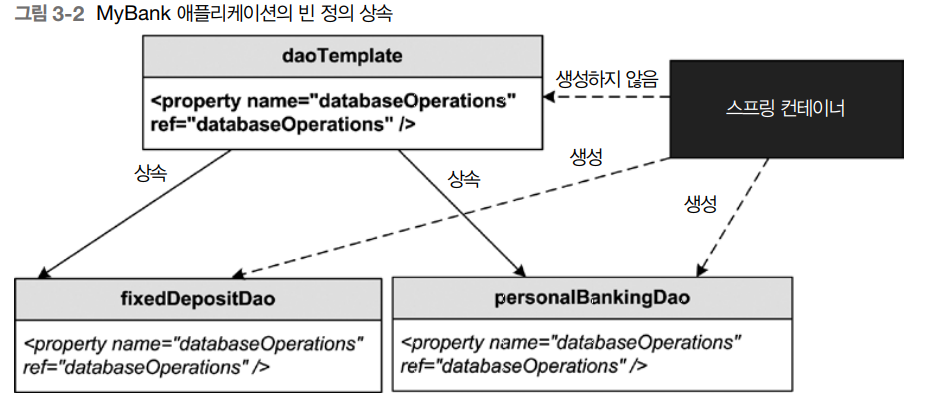

## 프로젝트 생성 pom.xml
```xml
<dependency>
    <groupId>org.springframework</groupId>
    <artifactId>spring-context</artifactId>
    <version>5.2.22.RELEASE</version>
</dependency>
<dependency>
    <groupId>org.projectlombok</groupId>
    <artifactId>lombok</artifactId>
    <version>1.18.26</version>
    <scope>provided</scope>
</dependency>
```

# 3.1 소개 
- 빈 정의 상속
- 빈 클래스의 생성자 인수를 찾는 방법 
- 원시타입이나 컬렉션 타입 또는 사용자 정의 타입을 사용해 빈 프로퍼티나 생성자 인수 설정
- 빈 프로퍼티에 p-namespace, 생성자 인수에 c-namespace를 활용한 XML파일 작성
- 빈 인스턴스를 생성하는 팩토리 클래스를 작성할 때 사용하는 스프링 FactoryBean 인터페이스
- 빈 설정 모듈화 

<br>

## 3.2 빈 정의 상속 
    빈 정의를 간결화하기 위해 빈 정의가 다른 빈 정의의 설정을 상속하는 경우 

<br>

### 3.2.1 빈 정의 상속 예제 


```java
// 도메인 
package bankapp_chap03.domain;
//...

@ToString
@Setter
@Getter
@Builder
@AllArgsConstructor
@NoArgsConstructor
public class BankStatement {
	private Date transactionDate;
	private double amount;
	private String transactionType;
	private String referenceNumber;
}

@ToString
@Setter
@Getter
@Builder
@AllArgsConstructor
@NoArgsConstructor
public class FixedDepositDetails {
	private long id;
	private float depositAmount;
	private int tenure;
	private String email;
}

```

<br>

	DatabaseOperations : PersonnalBankingDao와 FixedDepositDao의 공통 설정이다.
	애플리케이션의 여러빈이 같은 설정집합을 공유한다면 다른 빈 정의의 부모역할을 하는 빈 정의를 만들 수 있다.

```java
package bankapp_chap03.util;

import java.util.Date;
import java.util.HashMap;
import java.util.Map;

import bankapp_chap03.domain.BankStatement;
import bankapp_chap03.domain.FixedDepositDetails;

public class DatabaseOperations {
	
	private static Map<Long, FixedDepositDetails> fixedDeposits = 
							new HashMap<Long, FixedDepositDetails>();
	
	public boolean saveFd(FixedDepositDetails fdd) {
		fixedDeposits.put(fdd.getId(), fdd);
		return true;
	}

	public FixedDepositDetails loadFd(long id) {
		return fixedDeposits.get(id);
	}

	public BankStatement getMiniStatement() {
		return BankStatement.builder()
				.amount(100)
				.referenceNumber("Ref. no. 1")
				.transactionDate(new Date())
				.transactionType("credit").build();
	}
}
```

<br>

```java
// Dao 인터페이스 
package bankapp_chap03.dao;

// FixedDepositDao
public interface FixedDepositDao {

	FixedDepositDetails getFixedDepositDetails(long id);

	boolean createFixedDeposit(FixedDepositDetails fdd);
}

// PersonalBakingDao
public interface PersonalBakingDao {
	BankStatement getMiniStatement();
}

// Dao 구현체 
// FixedDepositDaoImpl
@Setter
public class FixedDepositDaoImpl implements FixedDepositDao {
	
	private DatabaseOperations databaseOperations;

	public FixedDepositDaoImpl() {
		System.out.println("FixedDepositDaoImpl 생성");
	}
	
	@Override
	public FixedDepositDetails getFixedDepositDetails(long id) {
		return databaseOperations.loadFd(id);
	}

	@Override
	public boolean createFixedDeposit(FixedDepositDetails fdd) {
		return databaseOperations.saveFd(fdd);
	}
}

// PersonalBankingDaoImpl
@Setter
public class PersonalBankingDaoImpl implements PersonalBakingDao {

	private DatabaseOperations databaseOperations;
	
	@Override
	public BankStatement getMiniStatement() {
		return databaseOperations.getMiniStatement();
	}
}

```

<br>

```java
// 서비스
package bankapp_chap03.service;

public interface FixedDepositService {
	
	FixedDepositDao getFixedDepositDao();

	FixedDepositDetails getFixedDepositDetails(long id);

	boolean createFixedDeposit(FixedDepositDetails fdd);
}

public interface PersonalBankingService {
	BankStatement getMiniStatement();
}


// 서비스 구현체 
// FixedDepositServiceImpl
@Setter
public class FixedDepositServiceImpl implements FixedDepositService {

	private FixedDepositDao fixedDepositDao;
	
	public FixedDepositServiceImpl() {
		System.out.println("FixedDepositServiceImpl 생성");
	}
	
	@Override
	public FixedDepositDao getFixedDepositDao() {
		return fixedDepositDao;
	}

	@Override
	public FixedDepositDetails getFixedDepositDetails(long id) {
		return fixedDepositDao.getFixedDepositDetails(id);
	}

	@Override
	public boolean createFixedDeposit(FixedDepositDetails fdd) {
		return fixedDepositDao.createFixedDeposit(fdd);
	}
}

// PersonalBankingServiceImpl
@Setter
public class PersonalBankingServiceImpl implements PersonalBankingService {

	private PersonalBakingDao personalBakingDao;
	
	@Override
	public BankStatement getMiniStatement() {
		return personalBakingDao.getMiniStatement();
	}
}
```

<br>

```java
// 컨트롤러 인터페이스
package bankapp_chap03.controller;

public interface FixedDepositController {
	
	FixedDepositService getFixedDepositService();

	boolean submit(FixedDepositDetails fixedDepositDetails);

	FixedDepositDetails get();
}

public interface PersonalBankingController {
	BankStatement getMiniStatement();
}

// 컨트롤러 구현체
@Setter
@Getter
public class FixedDepositControllerImpl implements FixedDepositController {

	private FixedDepositService fixedDepositService;
	
	public FixedDepositControllerImpl() {
		System.out.println("FixedDepositControllerImpl 생성");
	}
	
	@Override
	public FixedDepositDetails get() {
		return fixedDepositService.getFixedDepositDetails(1L);
	}

	@Override
	public boolean submit(FixedDepositDetails fixedDepositDetails) {
		return fixedDepositService.createFixedDeposit(fixedDepositDetails);
	}
}

@AllArgsConstructor
public class PersonalBankingControllerImpl implements PersonalBankingController {

	private PersonalBankingService personalBankingService;
	
	@Override
	public BankStatement getMiniStatement() {
		return personalBankingService.getMiniStatement();
	}
}
```


```xml
<!-- 설정 파일 : applicationContext.xml-->
<?xml version="1.0" encoding="UTF-8"?>
<beans xmlns="http://www.springframework.org/schema/beans"
	xmlns:xsi="http://www.w3.org/2001/XMLSchema-instance"
	xsi:schemaLocation="http://www.springframework.org/schema/beans http://www.springframework.org/schema/beans/spring-beans.xsd">


	<!-- domain : 스코프가 프로토 타입에 유의 -->
	<bean id="fixedDepositDetails"
		class="bankapp_chap03.domain.FixedDepositDetails" scope="prototype" />

	<!-- util -->
	<bean id="databaseOperations" class="bankapp_chap03.util.DatabaseOperations"/>
	
	<!-- dao -->
	<bean id="personalBankingDao" class="bankapp_chap03.dao.PersonalBankingDaoImpl">
		<property name="databaseOperations" ref="databaseOperations"/>
	</bean>
	<bean id="fixedDepositDao" class="bankapp_chap03.dao.FixedDepositDaoImpl">
		<property name="databaseOperations" ref="databaseOperations"/>
	</bean>
	
	<!-- service -->
	<bean id="personalBankingService" class="bankapp_chap03.service.PersonalBankingServiceImpl">
		<property name="personalBakingDao" ref="personalBankingDao"/>
	</bean>
	<bean id="fixedDepositService" class="bankapp_chap03.service.FixedDepositServiceImpl">
		<property name="fixedDepositDao" ref="fixedDepositDao"/>
	</bean>
	
	<!-- controller -->
	<bean id="fixedDepositController" class="bankapp_chap03.controller.FixedDepositControllerImpl">
		<property name="fixedDepositService" ref="fixedDepositService"/>
	</bean>
	<bean id="personalBankingController" class="bankapp_chap03.controller.PersonalBankingControllerImpl">
		<constructor-arg ref="personalBankingService"/>
	</bean>
	
</beans>
```

```java
package bankapp_chap03;

public class BankApp {
	
	public static void main(String[] args) {
		ApplicationContext context = 
				new ClassPathXmlApplicationContext("classpath:applicationContext.xml");
		FixedDepositController fixedDepositController = context.getBean(FixedDepositController.class);
		PersonalBankingController personalBankingController = context.getBean(PersonalBankingController.class);
		
		FixedDepositDetails depositDetails = context.getBean(FixedDepositDetails.class); 
		depositDetails.setDepositAmount(100);
		depositDetails.setEmail("someemail@somedomain.com");
		depositDetails.setId(1);
		depositDetails.setTenure(10);
		
		fixedDepositController.submit(depositDetails);
		System.out.println(fixedDepositController.get());
		
		System.out.println(personalBankingController.getMiniStatement());
	}
}
```

<br>

    personalBankingDao와fixedDepositDao는 databaseOperations에 의존하고 있다. 
    애플리케이션의 여러 빈이 같은 설정 집합을 공유한다면 다른빈 정의의 부모역할을 하는 빈 정의를 만들수있다.
```xml
<!-- util -->
<bean id="databaseOperations" class="bankapp_chap03.util.DatabaseOperations"/>

<!-- dao -->
<bean id="personalBankingDao" class="bankapp_chap03.dao.PersonalBankingDaoImpl">
    <property name="databaseOperations" ref="databaseOperations"/>
</bean>
<bean id="fixedDepositDao" class="bankapp_chap03.dao.FixedDepositDaoImpl">
    <property name="databaseOperations" ref="databaseOperations"/>
</bean>
```

<br>
    위 설정을 다음과 같이 변경하자 .
    abstract속성이 true이면 빈은 추상빈이 된다. class속성을 정의하지 않는다. 
    스프링 컨테이너는 추상빈 정의에 해당하는 빈을 생성하지 않는다.
    
```xml
<!-- dao -->
<bean id="daoTemplate" abstract="true">
    <property name="databaseOperations" ref="databaseOperations"/>
</bean>

<bean id="personalBankingDao" parent="daoTemplate" class="bankapp_chap03.dao.PersonalBankingDaoImpl"/>
<bean id="fixedDepositDao" parent="daoTemplate" class="bankapp_chap03.dao.FixedDepositDaoImpl"/>
```
    
	다음은 빈 상속이 fixedDeposit과 personalBankingDao빈 정의에 대해 어떻게 작용하지는지 보여준다. 



<br>

## 3.2.2 상속할 수 있는 정보
	프로퍼티 
	생성자 인수
	메서드 오버라이드 
	초기화와 정리 메서드
	팩토리 메서드 

### 빈정의 상속의 예 - 부모 빈 정의가 추상이 아닌 경우
```java
package bankapp_chap03.base;

public class EmailMessageSender {
	public void info() {
		System.out.println("EmailMessageSender 서비스");
	}
}

public class JmsMessageSender {
	public void info() {
		System.out.println("JmsMessageSender 서비스");
	}
}

public class WebServiceInvoker {
	public void info() {
		System.out.println("WebServiceInvoker 서비스");
	}
}

@Setter
@Getter
public class ServiceTemplate {
	private JmsMessageSender jmsMessageSender;
	private EmailMessageSender emailMessageSender;
	private WebServiceInvoker webServiceInvoker;	
}
```
	
```java
// 서비스 구현체를 다음과같이 ServiceTemplate 상속하도록 수정한다.
@Setter @Getter
public class FixedDepositServiceImpl extends ServiceTemplate implements FixedDepositService {/*..*/}

@Setter @Getter
public class PersonalBankingServiceImpl extends ServiceTemplate implements PersonalBankingService {/*..*/}
```

	jmsMessageSender, emailMessageSender, webServiceInvoker 스프링빈으로 정의
	serviceTemplate 스프링빈 정의 위에 등록한 빈을 세터DI 
	personalBankingService, fixedDepositService 빈의 부모빈으로 serviceTemplate 지정
```xml
	<!-- base -->
	<bean id="jmsMessageSender" class="bankapp_chap03.base.JmsMessageSender"/>
	<bean id="emailMessageSender" class="bankapp_chap03.base.EmailMessageSender"/>
	<bean id="webServiceInvoker" class="bankapp_chap03.base.WebServiceInvoker"/>
	
	<bean id="serviceTemplate" class="bankapp_chap03.base.ServiceTemplate">
		<property name="jmsMessageSender" ref="jmsMessageSender"/>
		<property name="emailMessageSender" ref="emailMessageSender"/>
		<property name="webServiceInvoker" ref="webServiceInvoker"/>
	</bean>

	<!-- service -->
	<bean id="personalBankingService" parent="serviceTemplate" 
			class="bankapp_chap03.service.PersonalBankingServiceImpl">
		<property name="personalBakingDao" ref="personalBankingDao"/>
	</bean>
	<bean id="fixedDepositService" parent="serviceTemplate" 
			class="bankapp_chap03.service.FixedDepositServiceImpl">
		<property name="fixedDepositDao" ref="fixedDepositDao"/>
	</bean>	
```

```java
public class BankApp2 {
	
	public static void main(String[] args) {
		ApplicationContext context = 
				new ClassPathXmlApplicationContext("classpath:applicationContext.xml");
		
		PersonalBankingServiceImpl bean = context.getBean(PersonalBankingServiceImpl.class);
		bean.getEmailMessageSender().info();
		bean.getJmsMessageSender().info();
		bean.getWebServiceInvoker().info();
		
		FixedDepositServiceImpl bean2 = context.getBean(FixedDepositServiceImpl.class);
		bean2.getEmailMessageSender().info();
		bean2.getJmsMessageSender().info();
		bean2.getWebServiceInvoker().info();
	}
}
```

### 빈정의 상속의 예 - 패토리 메서드 설정 상속하기 
```java
package bankapp_chap03.controller;

public class ControllerFactory {
	
	// 팩토리 메소드 : 자신에게 전달된 controllerName 인수값에 따라 
	// fixedDepositController, personalBankingController 생성
	public Object getController(String controllerName) {
		Object controller = null;
		if("fixedDepositController".equalsIgnoreCase(controllerName)) {
			controller = new FixedDepositControllerImpl();
		}
		if("personalBankingController".equalsIgnoreCase(controllerName)) {
			controller = new PersonalBankingControllerImpl();
		}
		return controller; 
	}
}

@Getter @Setter
public class FixedDepositControllerImpl implements FixedDepositController {}

@Setter
public class PersonalBankingControllerImpl implements PersonalBankingController {}
```

	controllerTemplate빈 정의가 추상이므로 getController팩토리 메서드 설정을 사용할지 여부를 결정하는 것은
	자식빈  정의인 fixedDepositController 또는 personalBankingController 이다.
	constructor-arg 엘리먼트를 사용해 인수를 인스턴스 팩토리 메서드에 전달하였다. 
	BankApp 클래스의 메인메소드를 실행하여 확인한다. 
```xml
	<!-- controller -->
<bean id="controllerFactory" class="bankapp_chap03.controller.ControllerFactory"/>

<bean id="controllerTemplate" factory-bean="controllerFactory"
	factory-method="getController" abstract="true"/>

<bean id="fixedDepositController" parent="controllerTemplate">
	<constructor-arg index="0" value="fixedDepositController"/>
	<property name="fixedDepositService" ref="fixedDepositService"/>
</bean> 
<bean id="personalBankingController" parent="controllerTemplate">
	<constructor-arg index="0" value="personalBankingController"/>
	<property name="personalBankingService" ref="personalBankingService"/>
</bean>
```

<br>

## 3.3 생성자 인수 매치하기 

### 3.3.1 constructor-arg 엘리먼트를 사용해 빈 참조나 단순한 값 전달하기 
```java
// Request
package bankapp_chap03.domain;
public class Request {}

// UserRequestController
package bankapp_chap03.controller;
import bankapp_chap03.domain.Request;

public interface UserRequestController {
	void submitRequest(Request request);
}

// UserRequestControllerImpl
public class UserRequestControllerImpl implements UserRequestController {
	
	private ServiceTemplate serviceTemplate;

	public UserRequestControllerImpl(ServiceTemplate serviceTemplate) {
		this.serviceTemplate = serviceTemplate;
	}

	@Override
	public void submitRequest(Request request) {
		System.out.println("UserRequestControllerImpl:submitRequest 실행");
		serviceTemplate.getJmsMessageSender().info();
	}
}
```

```xml
<!-- constructor-arg엘리먼트의 ref 속성을 사용해 ServiceTemplate 인스턴스의 참조를 
UserRequestControllerImpl의 생성자에 넘긴다. -->
<bean id="userRequestController" class="bankapp_chap03.controller.UserRequestControllerImpl">
	<constructor-arg index="0" ref="serviceTemplate"/>
</bean>
```

```java
package bankapp_chap03.controller;
public class UserRequestControllerImplTest {

	@Test
	public void test() {
		ClassPathXmlApplicationContext context = 
				new ClassPathXmlApplicationContext("classpath:applicationContext.xml");
		UserRequestController bean = context.getBean(UserRequestController.class);
		bean.submitRequest(new Request());
	}
}
```

<br>

### 3.3.2 타입으로 생성자 인수 매치시키기
	constructor-arg 엘리먼트의 index 속성을 지정하지 않으면
	constructor-arg 엘리먼트에 의해 참조되는 타입을 빈 클래스 생서자의 인수 타입과 매치시켜 
	어떤 생성자 인수를 호출할지 결정한다. 
```java
@Getter
@Setter
@NoArgsConstructor
public class ServiceTemplate {
	private JmsMessageSender jmsMessageSender;
	private EmailMessageSender emailMessageSender;
	private WebServiceInvoker webServiceInvoker;
	
	public ServiceTemplate(JmsMessageSender jmsMessageSender,
			EmailMessageSender emailMessageSender,
			WebServiceInvoker webServiceInvoker) {
		this.jmsMessageSender = jmsMessageSender;
		this.emailMessageSender = emailMessageSender;
		this.webServiceInvoker = webServiceInvoker;
	}	
}

@Setter @Getter
public class FixedDepositServiceImpl extends ServiceTemplate implements FixedDepositService {
	//...
	public FixedDepositServiceImpl(JmsMessageSender jmsMessageSender,
			EmailMessageSender emailMessageSender,
			WebServiceInvoker webServiceInvoker) {
		super(jmsMessageSender, emailMessageSender, webServiceInvoker);
	}
	//...
}

@Setter @Getter
public class PersonalBankingServiceImpl extends ServiceTemplate implements PersonalBankingService {
	//...
	public PersonalBankingServiceImpl(JmsMessageSender jmsMessageSender,
			EmailMessageSender emailMessageSender,
			WebServiceInvoker webServiceInvoker) {
		super(jmsMessageSender, emailMessageSender, webServiceInvoker);
	}
	//...
}
```

```xml
<!-- 생성자의 순서와  constructor-arg엘리먼트로 정의한 생성자의 순서가 다르다.
 타입을 모두 구분할 수 있으므로 스프링컨테이너는 올바른 순서로 ServiceTemplate을 주입한다.-->
<bean id="serviceTemplate" class="bankapp_chap03.base.ServiceTemplate">
	<constructor-arg ref="emailMessageSender"/>
	<constructor-arg ref="jmsMessageSender"/>
	<constructor-arg ref="webServiceInvoker"/>
</bean>
```

### 상속 관계인 스프링 빈들을 생성자 인수로 사용하기 
```java
package bankapp_chap03.example;

public class ABean {
	public void methodA() {
		System.out.println("methodA");
	}
}

public class BBean extends ABean{
	public void methodB() {
		System.out.println("methodB");
	}
}

public class SampleBean {
	
	private ABean aBean; 
	private BBean bBean;

	public SampleBean(ABean aBean, BBean bBean) {
		this.aBean = aBean;
		this.bBean = bBean;
	}
	
	public void execute() {
		aBean.methodA();
		bBean.methodB();
	}
}
```
```xml
<bean id="aBean" class="bankapp_chap03.example.ABean"/>
<bean id="bBean" class="bankapp_chap03.example.BBean"/>

<!-- 상속관계가 있을 때  타입을 지정하지않으면 같은 타입으로 보기 때문에 예외가 발생한다. -->
<bean id="sampleBean" class="bankapp_chap03.example.SampleBean">
	<constructor-arg ref="bBean" type="bankapp_chap03.example.BBean" />
	<constructor-arg ref="aBean" type="bankapp_chap03.example.ABean" />
</bean>
```
	둘 이상의 생성자 인수가 같은 타입이라면 constructor-arg를 어떤 생성자 인수에 적용할지 
	지정할 수 있는 유일한 방법은 index속성을 사용하는 것 뿐이다. 


### 표준 자바타입과 사용자 지정 타입을 생성자 인수로 사용하기 

```java
package bankapp_chap03.service;

public interface TransferFundsService {
	public void transferFunds();	
}

public class TransferFundsServiceImpl implements TransferFundsService {

	private String webServiceUrl;
	private boolean active;
	private long timeout;
	private int numberOfRetrialAttempts;
	
	public TransferFundsServiceImpl(String webServiceUrl, boolean active, 
			long timeout, int numberOfRetrialAttempts) {
		this.webServiceUrl = webServiceUrl;
		this.active = active;
		this.timeout = timeout;
		this.numberOfRetrialAttempts = numberOfRetrialAttempts;
	}

	@Override
	public void transferFunds() {
		System.out.println("=================================================");
		System.out.println("transferFunds메서드실행");
		System.out.println("webServiceUrl : "+webServiceUrl);
		System.out.println("active : "+active);
		System.out.println("timeout : "+timeout);
		System.out.println("numberOfRetrialAttempts : "+numberOfRetrialAttempts);
		System.out.println("=================================================");
	}
}
```
	생성자의 순서에 따라 값이 설정된다.
	webServiceUrl = http://someUrl.com/xyz
	active = true
	timeout = 5
	numberOfRetrialAttempts = 200
```xml
<bean id="transferFundsService" class="bankapp_chap03.service.TransferFundsServiceImpl">
	<constructor-arg value="http://someUrl.com/xyz"/>
	<constructor-arg value="true"/>
	<constructor-arg value="5"/>
	<constructor-arg value="200"/>
</bean>
```
	timeout=200 이고 numberOfRetrialAttempts=5을 의도했다고 가정하자.
	타입을 지정하면 스프링컨테이너가 해당 타입에 맞게 값을 주입한다. 
```xml
<bean id="transferFundsService" class="bankapp_chap03.service.TransferFundsServiceImpl">
	<constructor-arg value="http://someUrl.com/xyz" type="java.lang.String" />
	<constructor-arg value="true" type="boolean"/>
	<constructor-arg value="5" type="int"/>
	<constructor-arg value="200" type="long"/>
</bean>
```

```java
public class TransferFundsServiceImplTest {

	@Test
	public void typMatchingTest() {
		ClassPathXmlApplicationContext context = 
				new ClassPathXmlApplicationContext("classpath:applicationContext.xml");
		TransferFundsServiceImpl bean = context.getBean(TransferFundsServiceImpl.class);
		bean.transferFunds();
	}
}
```


### 3.3.3 이름으로 생성자 인수 매치시키기 
	name속성을 사용하면 constructor-arg 엘리먼트를 적용할 생성자 인수의 이름을 지정할 수 있다. 
	생성자에서 @ConstructorProperties 어노테이션으로 이름을 지정한다. 
	이 때 이름은 인수의 순서대로 지정된다. 
```java
public class TransferFundsServiceImpl implements TransferFundsService {

	//...	
	@ConstructorProperties(value = {
			"webServiceUrl", "active", "timeout","numberOfRetrialAttempts"
	})
	public TransferFundsServiceImpl(String webServiceUrl, boolean active, 
			long timeout, int numberOfRetrialAttempts) {
		this.webServiceUrl = webServiceUrl;
		this.active = active;
		this.timeout = timeout;
		this.numberOfRetrialAttempts = numberOfRetrialAttempts;
	}
	//...
}
```
```xml
<bean id="transferFundsService" class="bankapp_chap03.service.TransferFundsServiceImpl">
	<constructor-arg value="http://someUrl.com/xyz" name="webServiceUrl" />
	<constructor-arg value="true" type="boolean" name="active"/>
	<constructor-arg value="5" name="numberOfRetrialAttempts"/>
	<constructor-arg value="200" name="timeout" />
</bean>
```

### @ConstructorProperties와 빈 정의 상속 
	부모 빈 정의에 해당하는 클래스 생성자에 @ConstructorProperties가 있으면, 자식빈에 해당하는
	빈 클래스 생성자에도 반드시 @ConstructorProperties가 있어야 한다. 
	@ConstructorProperties에서 정한 이름과 자식빈클래스 생성자의 매개변수이름이 모두 일치하면 
	@ConstructorProperties를 정의할 필요없다. 

```java
// 부모빈 
@Getter
@Setter
@NoArgsConstructor
public class ServiceTemplate {
	private JmsMessageSender jmsMessageSender;
	private EmailMessageSender emailMessageSender;
	private WebServiceInvoker webServiceInvoker;
	
	@ConstructorProperties({ "jms", "email", "invoker" })
	public ServiceTemplate(JmsMessageSender jmsMessageSender,
			EmailMessageSender emailMessageSender,
			WebServiceInvoker webServiceInvoker) {
		this.jmsMessageSender = jmsMessageSender;
		this.emailMessageSender = emailMessageSender;
		this.webServiceInvoker = webServiceInvoker;
	}	
}

// 자식빈 
public class FixedDepositServiceImpl extends ServiceTemplate implements FixedDepositService {
	//...
	// 각각의 매개변수이름과 @ConstructorProperties에서 지정한 이름이 모두 일치함
	public FixedDepositServiceImpl(JmsMessageSender jms,
			EmailMessageSender email, WebServiceInvoker invoker) {
		super(jms, email, invoker);
	}
	//...
}

public class PersonalBankingServiceImpl extends ServiceTemplate implements PersonalBankingService {

	//...
	
	public PersonalBankingServiceImpl(JmsMessageSender jms,
			EmailMessageSender email, WebServiceInvoker invoker) {
		super(jms, email, invoker);
	}
	//...
}
```
```xml
<bean id="serviceTemplate" class="bankapp_chap03.base.ServiceTemplate">
	<constructor-arg ref="jmsMessageSender" name="jms"/>
	<constructor-arg ref="emailMessageSender" name="email"/>
	<constructor-arg ref="webServiceInvoker" name="invoker"/>
</bean>
```

<br>

## 3.4 다른 타입의 빈 프로퍼티와 생성자 인수 설정하기 
	java.util.Date, java.util.Currency, 원시 타입등의 다양한 타입을 
	빈 프로퍼티나 생성자 인수로 넘길 수 있도록 지원해주는 PropertyEditor 구현에 대해 학습한다.
	스프링 내장 PropertyEditor 구현을 사용을 보여주는 예부터 알아본다. 

### 3.4.1 스프링 내장 프로퍼티 에디터 
	PropertyEditor는 자바 타입을 문자열값으로 바꾸거나 역방향으로 바꾸위해 필요한 로직을 제공한다.
```java
package bankapp_chap03.beans;

import java.util.Currency;
import java.util.Date;
import java.util.Properties;

@Getter
@Setter
public class BankDetails {
	private String bankName;
	private byte[] bankPrimaryBusiness;
	private char[] headOfficeAddress;
	private char privateBank;
	private Currency primaryCurrency;
	private Properties branchAddresses;
}
```

<br>

	스프링 컨테이너는 각 프로퍼티에 설정된 문자열값을 등록된 자바빈의 PropertyEditor를 사용하여 
	그 에 상응하는 자바타입으로 변환한다. 
```xml
<!-- peropertyEditorConfig.xml  -->
<bean id="bankDetails" class="bankapp_chap03.beans.BankDetails">
	<property name="bankName" value="My Personal Bank" />
	<property name="bankPrimaryBusiness" value="Retail banking" />
	<property name="headOfficeAddress" value="Address of head office" />
	<property name="privateBank" value="Y" />
	<property name="primaryCurrency" value="INR" />
	<property name="branchAddresses">
		<value>
			x = Branch X's address
			y = Branch Y's address
			z = Branch Z's address
		</value>
	</property>
</bean>
```

<br>

	스프링의 모든 내장 PropertyEditor가 스프링 컨테이너에 기본값으로 등록되진 않는다. 
	문자열값을 java.util.Date타입으로 변환하고 싶다면 CustomDateEditor를 명시적으로 등록해야한다. 
```java
public class MyPropertyEditorRegistrar implements PropertyEditorRegistrar{

	@Override
	public void registerCustomEditors(PropertyEditorRegistry registry) {
		registry.registerCustomEditor(Date.class, 
			new CustomDateEditor(new SimpleDateFormat("yyyy-MM-dd"), false));
	}
}
```

```xml
<bean id="myPropertyEditorRegistrar" class="bankapp_chap03.beans.MyPropertyEditorRegistrar"/>
	<bean class="org.springframework.beans.factory.config.CustomEditorConfigurer">
	<property name="propertyEditorRegistrars">
		<list>
			<ref bean="myPropertyEditorRegistrar"/>
		</list>
	</property>
</bean>
```

<br>

	BankDetails에 Date타입의 필드를 추가하고 
	xml설정에서 값을 주입해보자.
```java
public class BankDetails {
	//...
	private Date dateOfInception;
}
```
```xml
<!-- peropertyEditorConfig.xml  -->
<bean id="bankDetails" class="bankapp_chap03.beans.BankDetails">
	<!-- .... -->
	<property name="dateOfInception" value="2023-12-31"/>
</bean>
```

<br>

### 3.4.2 컬렉션 타입에 값 지정하기 
	List, Set, Map 타입의 프로퍼티나 생성자 인수를 설정하려면 property나 construcotr-arg엘리먼트의 list, map, set 하위 엘리먼트를 사용한다. 
```java
@ToString
public class DataTypesExample {
	
	List<String> listType;
	Properties propertiesType;
	Properties anotherPropertiesType;
	Map mapType;
	Set setType;
	
	@ConstructorProperties({"listType","propertiesType","anotherPropertiesType","mapType","setType"})
	public DataTypesExample(List<String> listType, Properties propertiesType, Properties anotherPropertiesType,
			Map mapType, Set setType) {
		this.listType = listType;
		this.propertiesType = propertiesType;
		this.anotherPropertiesType = anotherPropertiesType;
		this.mapType = mapType;
		this.setType = setType;
	}
}
```
```xml
<!-- peropertyEditorConfig.xml -->
<bean id="dataTypesExample" class="bankapp_chap03.beans.DataTypesExample">
	<constructor-arg name="listType">
		<list>
			<value>강호동</value>
			<value>드웨인존슨</value>
			<value>블록레스너</value>
			<value>마이크타이슨</value>
		</list>
	</constructor-arg>
	<constructor-arg name="propertiesType">
		<props>
			<prop key="book">스프링5프로그래밍입문</prop>
		</props>
	</constructor-arg>
	<constructor-arg name="anotherPropertiesType">
		<value>
			x = xxxxxxxxxxxxxxxxxx
			y = yyyyyyyyyyyyyyyyyy
		</value>
	</constructor-arg>
	<constructor-arg name="mapType">
		<map>
			<entry>
				<key>
					<value>name</value>
				</key>
				<value>홍길동</value>
			</entry>
		</map>
	</constructor-arg>
	<constructor-arg name="setType">
		<set>
			<value>임꺽정</value>
			<value>김두한</value>
		</set>		
	</constructor-arg>
</bean>
```

<br>

### 컬렉션 타입에 List,Map,Set,Properties 넣기 
	List<List>타입인 경우 list엘리먼트를 list에 내보시킬 수 있음
	마찬가지로 List<Map>, List<Set>, List<Properties>도 가능함
	set엘리멘트와 map엘리먼트도 동일하게 적용된다. 

```java
package bankapp_chap03.beans;

@Getter
public class CollectionTypeExample {
	
	List<List<String>> stringList;
	Map<String, List<String>> mapList;

	public CollectionTypeExample(List<List<String>> stringList, Map<String, List<String>> mapList) {
		this.stringList = stringList;
		this.mapList = mapList;
	}
}
```
```xml
<bean id="collectionTypeExample" class="bankapp_chap03.beans.CollectionTypeExample">
	<constructor-arg index="0">
		<list>
			<list>
				<value>홍길동</value>
				<value>임꺽정</value>
			</list>
			<list>
				<value>김두한</value>
				<value>이정재</value>
			</list>
			<list>
				<value>손흥민</value>
				<value>김민재</value>
				<value>박지성</value>
			</list>
		</list>
	</constructor-arg>
	<constructor-arg index="1">
		<map>
			<entry>
				<key>
					<value>축구선수</value>
				</key>
				<list>
					<value>손흥민</value>
					<value>김민재</value>
					<value>박지성</value>
				</list>
			</entry>
			<entry>
				<key>
					<value>야인</value>
				</key>
				<list>
					<value>김두한</value>
					<value>이정재</value>
				</list>
			</entry>
		</map>
	</constructor-arg>
</bean>
```
```java
package bankapp_chap03.beans;

import org.junit.Test;
import org.springframework.context.support.ClassPathXmlApplicationContext;

public class CollectionTypeExampleTest {

	@Test
	public void test() {
		ClassPathXmlApplicationContext context =
				new ClassPathXmlApplicationContext("classpath:peropertyEditorConfig.xml");
		CollectionTypeExample bean = context.getBean(CollectionTypeExample.class);
		System.out.println(bean.getStringList());
		System.out.println(bean.getMapList());
	}
}
```

<br>

### 컬렉션 타입에 빈 참조 추가 
```java
package bankapp_chap03.collection_ref;

public interface DemoBean {}
public class DemoA implements DemoBean{}
public class DemoB implements DemoBean{}

@Setter
@ToString
public class DemoVO {
	private List<DemoBean> demoList;
	private Map<DemoBean, DemoBean> demoMap;
}
```
```xml
<!-- collectionRefContext.xml -->
<bean id="demoA" class="bankapp_chap03.collection_ref.DemoA"/>
<bean id="demoB" class="bankapp_chap03.collection_ref.DemoB"/>
<bean id="demoVO" class="bankapp_chap03.collection_ref.DemoVO">
	<property name="demoList">
		<list>
			<ref bean="demoA"/>
			<ref bean="demoB"/>
		</list>
	</property>
	<property name="demoMap">
		<map>
			<entry>
				<key><ref bean="demoA"/></key>
				<ref bean="demoB"/>
			</entry>
		</map>
	</property>
</bean>
```
```java
public class DemoVOTest {

	@Test
	public void test() {
		ClassPathXmlApplicationContext context =
				new ClassPathXmlApplicationContext("classpath:collectionRefContext.xml");
		DemoVO bean = context.getBean(DemoVO.class,"demoVO");
		System.out.println(bean);
	}
}
```

<br>

### 컬렉션 타입에 빈 이름 추가 
	빈 이름 문자열로 설정할 때 value 엘리먼트를 사용할 수도 있겠지만 
	idref엘리먼트를 사용하면 애플리케이션이 실행될 때 스프링 컨테이너가 
	이름이 존재하는지 검증해 준다.
```java
package bankapp_chap03.collection_ref;

@ToString
@Setter
public class SampleBean {
	Map<String, DemoBean> beanList;
}
```
```xml
<!-- collectionRefContext.xml -->
<bean id="sampleBean" class="bankapp_chap03.collection_ref.SampleBean">
	<property name="beanList">
		<map>
			<entry>
				<key><idref bean="demoA"/></key>
				<ref bean="demoA" />
			</entry>
		</map>
	</property>
</bean>
```

<br>

### 컬렉션 타입에 null 값 추가

```java
@Setter
@ToString
public class NullVO {
	List<String> stringList;
	Map<String,String> mapList;
}

```
```xml
<bean id="nullVO" class="bankapp_chap03.collection_ref.NullVO">
	<property name="stringList">
		<list>
			<value>홍길동</value>
			<null/>
			<null/>
		</list>
	</property>
	<property name="mapList">
		<map>
			<entry>
				<key>
					<value>홍</value>
				</key>
				<value>길동</value>
			</entry>
			<entry>
				<key>
					<null/>
				</key>
				<null/>
			</entry>
		</map>
	</property>
</bean>
```
```java
public class NullVOTest {
	@Test
	public void test() {
		ClassPathXmlApplicationContext context =
				new ClassPathXmlApplicationContext("classpath:collectionRefContext.xml");
		NullVO bean = context.getBean(NullVO.class);
		System.out.println(bean);
	}
}
```

<br>

### 3.4.3 배열에 값 지정하기
	array 엘리먼트안에 list, set, map 엘리먼트를 사용할 수 있고 그 반대도 가능함
	2차원 이상의배열을 만들 때는 array엘리먼트를 중첩하여 사용한다. 
```java
@Setter
@Getter
public class MyArray1 {
	int[] numbersProp; 
}
```
```xml
<!-- arrayContext.xml -->
<bean id="myArray1" class="bankapp_chap03.array.MyArray1">
	<property name="numbersProp">
		<array>
			<value>1</value>
			<value>2</value>
			<value>3</value>
		</array>
		<!-- array 대신 list 엘리먼트를 사용할 수 있음-->
	</property>
</bean>
```
```java
public class MyArray1Test {

	@Test
	public void test() {
		ClassPathXmlApplicationContext context =
				new ClassPathXmlApplicationContext("classpath:arrayContext.xml");
		MyArray1 bean = context.getBean(MyArray1.class);
		System.out.println(Arrays.toString(bean.getNumbersProp()));
	}
}
```

<br>

### 3.4.4 list, set, map 엘리먼트의 디폴트 구현 
	list : java.util.ArrayList
	set : java.util.LinkedHashSet
	map : java.util.LinkedHashSet
	다음과 같이 디폴트 구현이 아니 다른 구현을 사용할 수 있다. 
```xml
<map value-type="java.util.HashMap">
	<entry>
		<key><idref bean="demoA"/></key>
		<ref bean="demoA" />
	</entry>
</map>
```	

<br>

## 3.5 내장 프로퍼티 에디터 
	CustomCollectionEditor
	CustomMapEditor
	CustomDateEditor

### 3.5.1 CustomCollectionEditor
	CustomCollectionEditor는 원본 컬렉션 타입을 대상 컬렉션 타입으로 변환할 때 쓰인다.
	Set, SortedSet, List 타입에 대해 등록되어있다. 

```java
@Setter
@ToString
public class CollectionTypeDemo {
	private Set<String> setType; 
	private List<String> listType;
}
```

	listType프로퍼티를 set엘리먼트로 지정
		CustomCollectionEditor가 listType 프로퍼티를 설정하기 전에 LinkedHashSet을 ArrayList타입으로 변환한다.
	setType프로퍼티를 list엘리먼트로 지정 
		CustomCollectionEditor가 setType 프로퍼티를 설정하기 전에 ArrayList을 LinkedHashSet타입으로 변환한다.
	
```xml
<!-- collectionTypeContext.xml -->
<bean id="collectionTypeDemo" class="bankapp_chap03.custom_collection_editor.CollectionTypeDemo">
	<property name="listType">
		<set>
			<value>Sample01</value>
			<value>Sample02</value>
			<value>Sample03</value>
		</set>
	</property>
	<property name="setType">
		<list>
			<value>Demo01</value>
			<value>Demo02</value>
			<value>Demo03</value>
		</list>
	</property>
</bean>
```
```java
public class CollectionTypeDemoTest {
	
	@Test
	public void test() {
		ClassPathXmlApplicationContext context =new ClassPathXmlApplicationContext("collectionTypeContext.xml");
		CollectionTypeDemo bean = context.getBean(CollectionTypeDemo.class);
		System.out.println(bean);
		context.close();
	}
}
```
### 3.5.3 CustomDateEditor
	java.util.Date타입을 문자열로 형식화하여 만듬
	날짜/시간을 표현하는 문자열을 파싱하여 java.util.Date타입의 객체를 만듬

## 3.6 스프링 컨테이너에 프로퍼티 에디터 등록
	BeanWrapperImpl 클래스 : 몇 가지 내장 프로퍼티 에디터를 스프링 컨테이너에 등록함
	기본적으로 등록되는 프로퍼티 에디터 
		CustomCollectionEditor, CustomMapEditor, 
		CurrencyEditor, ByteArrayPropertyEditor, CharacterEditor
	CustomDateEditor는 등록되지 않는다. 

	CustomEditorConfigurer : 프로퍼티 에디터를 등록할 수 있다. 
		스프링 컨테이너는 이 빈을 자동으로 감지한다. 
	
	프로퍼티 에디터를 스프링 컨테이너에 등록하는 순서
		1. PropertyEditorRegistrar 인터페이스의 구현체 생성 
		2. PropertyEditorRegistrar 구현을 스프링빈으로 등록
		3. CustomEditorConfigurer 빈 등록 후 PropertyEditorRegistrar구현에 대한 참조 지정


### 3.6.1 PropertyEditorRegistrar 구현
```java
package bankapp_chap03.beans;

import java.text.SimpleDateFormat;
import java.util.Date;
import org.springframework.beans.PropertyEditorRegistrar;
import org.springframework.beans.PropertyEditorRegistry;
import org.springframework.beans.propertyeditors.CustomDateEditor;

public class MyPropertyEditorRegistrar implements PropertyEditorRegistrar{

	@Override
	public void registerCustomEditors(PropertyEditorRegistry registry) {
		registry.registerCustomEditor(Date.class, 
			new CustomDateEditor(new SimpleDateFormat("yyyy-MM-dd"), false));
	}
}
```

### 3.6.2 CustomEditorConfigurer 클래스 설정
```xml
<!-- peropertyEditorConfig.xml -->
<bean id="myPropertyEditorRegistrar" class="bankapp_chap03.beans.MyPropertyEditorRegistrar"/>
	<bean class="org.springframework.beans.factory.config.CustomEditorConfigurer">
	<property name="propertyEditorRegistrars">
		<list>
			<ref bean="myPropertyEditorRegistrar"/>
		</list>
	</property>
</bean>
```

<br>

## 3.7 이름공간으로 빈정의를 간결하게 만들기 

### 3.7.1 p-이름공간
```java
package bankapp_chap03.namespace.p_namespace;

@Getter
@Setter
@ToString
public class Address {
	String code; 
	String zip;
}

@Getter
@Setter
@ToString
public class BankDetails {
	String bankName; 
	Address Address;  
}

// XML 설정 이후 실행 
public class BankDetailsTest {
	public static void main(String[] args) {
		FileSystemXmlApplicationContext ctx = 
				new FileSystemXmlApplicationContext(
				"src/main/java/bankapp_chap03/namespace/p_namespace/namespaceContext.xml");
		BankDetails bean = ctx.getBean(BankDetails.class);
		System.out.println(bean);
	}
}
```

	p:bankName="대구은행" 빈 값 설정
	p:address-ref="address" 빈 참조 
```xml
<!-- p_namespaceContext.xml -->
<bean id="address" class="bankapp_chap03.namespace.p_namespace.Address"
	p:code="대구광역시" 
	p:zip="405124"/>
	
<bean id="bankDetails" class="bankapp_chap03.namespace.p_namespace.BankDetails"
	p:bankName="대구은행"
	p:address-ref="address"/>
```

<br>

### 3.7.2 c-이름공간

### 생성자 인수에 이름을 지정하는 경우 
```java
package bankapp_chap03.namespace.c_namespace;

@ToString
public class Address {
	String code; 
	String zip;
	
	@ConstructorProperties({"code","zip"})
	public Address(String code, String zip) {
		this.code = code;
		this.zip = zip;
	}
}

@ToString
public class BankDetails {
	String bankName; 
	Address Address;
	
	@ConstructorProperties({"bankName", "address"})
	public BankDetails(String bankName, Address address) {
		this.bankName = bankName;
		Address = address;
	}
}

// XML 설정 이후 실행
public class BankDetailsTest {
	public static void main(String[] args) {
		FileSystemXmlApplicationContext ctx = 
				new FileSystemXmlApplicationContext(
				"src/main/java/bankapp_chap03/namespace/c_namespace/c_namespaceContext.xml");
		BankDetails bean = ctx.getBean(BankDetails.class);
		System.out.println(bean);
	}
}
```
```xml
<bean id="address" class="bankapp_chap03.namespace.c_namespace.Address"
	c:code="서울특별시" 
	c:zip="505113"/>
	
<bean id="bankDetails" class="bankapp_chap03.namespace.c_namespace.BankDetails"
	c:bankName="국민은행"
	c:address-ref="address"/>
```

### 생성자 인수의 인덱스를 이용하는 경우 

```xml
<!-- Address, BankDetails 생성자에 붙은 @ConstructorProperties 어노테이션 삭제 -->
<bean id="address" class="bankapp_chap03.namespace.c_namespace.Address"
	c:_0="부산광역시" 
	c:_1="780545"/>
	
<bean id="bankDetails" class="bankapp_chap03.namespace.c_namespace.BankDetails"
	c:_0="부산은행"
	c:_1-ref="address"/>
```

<br>

## 3.8 util 스키마

### 3.8.1 list
```java
package bankapp_chap03.util_schema;

@Setter @Getter @ToString
public class Box {
	String name;
}
@ToString @Setter
public class SimpleBean {
	private List<Box> boxList; 
	private List<String> nameList;
}

// XML 설정 후 실행
public class SimpleMain {
	public static void main(String[] args) {
		String path = "src/main/java/bankapp_chap03/util_schema/";
		ApplicationContext ctx 
			= new FileSystemXmlApplicationContext(path+"schemaContext.xml");
		SimpleBean bean = ctx.getBean(SimpleBean.class);
		System.out.println(bean);
	}
}
```
```xml
<!-- schemaContext.xml -->
<!-- 참조값 -->
<bean id="aaa" p:name="임꺽정" class="bankapp_chap03.util_schema.Box"/>
<bean id="bbb" p:name="홍길동" class="bankapp_chap03.util_schema.Box"/>
<bean id="ccc" p:name="김두한" class="bankapp_chap03.util_schema.Box"/>
<util:list id="boxList" list-class="java.util.ArrayList">
	<ref bean="aaa"/>
	<ref bean="bbb"/>
	<ref bean="ccc"/>
</util:list>

<!-- 기본값 및 문자열 -->	
<util:list id="nameList" list-class="java.util.ArrayList">
	<value>김두한</value>
	<value>이화룡</value>
	<value>구마적</value>
</util:list>

<bean id="simpleBean" class="bankapp_chap03.util_schema.SimpleBean"
	p:boxList-ref="boxList"
	p:nameList-ref="nameList"/>
```

### 3.8.2 map
```java
package bankapp_chap03.util_schema;

@Setter @Getter @ToString
public class Box {
	String name;
}

@Setter @ToString
public class ScoreBox {
	int score; 
}

@Setter @Getter @ToString
public class DemoMapBean {
	private Map<String, Integer> scoreMap;
	private Map<Box, ScoreBox> scoreBoxMap;
}

// XML설정 후 실행 
public class DemoMapBeanMain {
	public static void main(String[] args) {
		String path = "src/main/java/bankapp_chap03/util_schema/";
		ApplicationContext ctx 
			= new FileSystemXmlApplicationContext(path+"schemaContext.xml");
		DemoMapBean mapBean = ctx.getBean(DemoMapBean.class);
		System.out.println(mapBean);
	}
}
```
```xml
<!-- schemaContext.xml -->

<!-- key,value가 문자열 및 기본값일 때  -->
<util:map id="scoreMap" map-class="java.util.HashMap">
	<entry key="홍길동" value="100"/>
	<entry key="임꺽정" value="95"/>
	<entry key="김두한" value="77"/>
</util:map>	

<!-- key, value가 참조값일 때  -->
<bean id="hong" class="bankapp_chap03.util_schema.Box" p:name="홍길동"/>
<bean id="lim" class="bankapp_chap03.util_schema.Box" p:name="임꺽정"/>
<bean id="kim" class="bankapp_chap03.util_schema.Box" p:name="김두한"/>

<bean id="score1" class="bankapp_chap03.util_schema.ScoreBox" p:score="111" />
<bean id="score2" class="bankapp_chap03.util_schema.ScoreBox" p:score="95" />
<bean id="score3" class="bankapp_chap03.util_schema.ScoreBox" p:score="57" />

<util:map id="scoreBoxMap" map-class="java.util.HashMap">
	<entry key-ref="hong" value-ref="score1"/>
	<entry key-ref="lim" value-ref="score2"/>
	<entry key-ref="kim" value-ref="score3"/>
</util:map>
<bean id="demoMapBean" class="bankapp_chap03.util_schema.DemoMapBean"
	p:scoreMap-ref="scoreMap"
	p:scoreBoxMap-ref="scoreBoxMap"/>
```

### 3.8.3 set : list와 동일 생략 
	
### 3.8.4 properties
```java
package bankapp_chap03.util_schema;

@ToString
@Setter
@Getter
public class BranchAddress {
	Properties nameProp; 
	Properties dbInfo;
}


// 모든 설정 파일 설정 후 실행 
public class BranchAddressMain {
	
	public static void main(String[] args) {
		String path = "src/main/java/bankapp_chap03/util_schema/";
		ApplicationContext ctx 
			= new FileSystemXmlApplicationContext(path+"schemaContext.xml");
		BranchAddress bean = ctx.getBean(BranchAddress.class);
		System.out.println(bean);
	}
}
```
```properties
#클래스패스 위치 : dbinfo.properties
url=oracleUrl
driver=oracleDriver
username=leekwanghyup
```
```xml
<!-- 빈에서 참조  -->
<util:properties id="propList">
	<prop key="동천동">칠록3지구지점</prop>
	<prop key="검단동">검단공단지점</prop>
	<prop key="복현동">복현네거리지점</prop>
</util:properties>

<!-- properties 파일 불러오기 
	location 속성 : 
		- 프로퍼티파일이 존재하는 경로, 쉼표로 구분하여 여러개를 사용할 수 있음
		- classpath 또는 파일시스템 절대 경로 사용 
-->
<util:properties id="dbinfo" location="classpath:dbinfo.properties"/>			
<bean id="branchAddress" class="bankapp_chap03.util_schema.BranchAddress" 
	p:nameProp-ref="propList"
	p:dbInfo-ref="dbinfo"/>
```
```java

```

### 3.8.5 contstant

### 3.8.6 property-path

## 3.9 FactoryBean 인터페이스

## 3.10 빈 설정 모듈화하기